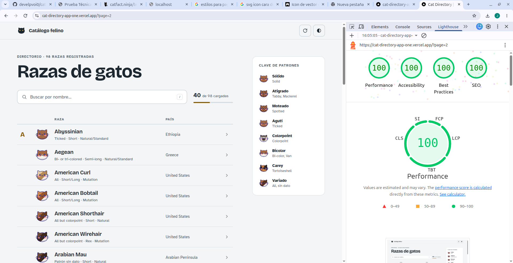
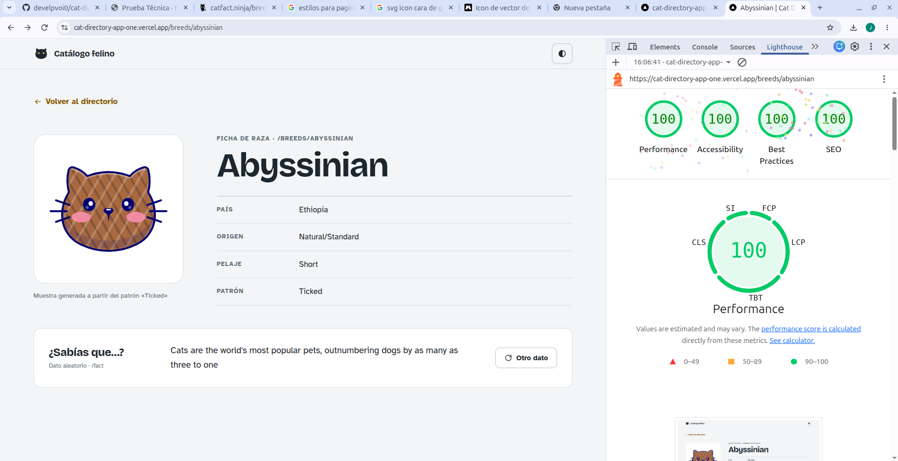

# Cat Directory · Catálogo felino

Directorio interactivo de razas de gatos construido sobre la API pública de [Catfact Ninja](https://catfact.ninja/). Prueba técnica Frontend Developer para Nextep Innovation.

**Demo:** _(https://cat-directory-app-one.vercel.app/)_

## Stack

Next.js 16 (App Router) · TypeScript · TanStack Query · TanStack Virtual · Zod · Tailwind CSS v4 · next-themes · sonner · Vitest

Se usa Next.js con App Router, el framework preferido por el enunciado, porque permite resolver la primera página en el servidor, generar las fichas de raza de forma estática con revalidación y hacer streaming del contenido que depende de la API.

## Cómo ejecutarlo

Requisitos: Node.js 20 o superior y [Bun](https://bun.sh) como gestor de paquetes.

```bash
bun install
bun run dev          # http://localhost:3000
bun run build && bun run start
bun run test         # pruebas unitarias con Vitest
```

> Usa `bun run test` y no `bun test`: este último ejecuta el runner propio de Bun, que no lee `vitest.config.mts`.

Variables de entorno opcionales (`.env.local`):

| Variable | Uso | Valor por defecto |
|---|---|---|
| `NEXT_PUBLIC_SITE_URL` | URL pública, usada en canonical, Open Graph y sitemap | `http://localhost:3000` |
| `NEXT_PUBLIC_API_BASE_URL` | Base de la API, útil para apuntar a un mock | `https://catfact.ninja` |

## Arquitectura

Organización por features, con la UI separada de la lógica y de la capa de datos:

```
src/
├── app/                    Rutas: composición y renderizado, sin lógica de negocio
│   ├── page.tsx            Home: shell estático + directorio en streaming
│   └── breeds/[slug]/      Ficha: SSG + ISR, loading, not-found y error propios
├── features/
│   ├── breeds/
│   │   ├── api/            Repositorio (fetch + Zod), query options y prefetch de servidor
│   │   ├── schemas/        Contratos de la API y modelo de dominio (Zod)
│   │   ├── state/          Estado de UI: Context + useReducer
│   │   ├── hooks/          Lista infinita, búsqueda, recarga, sync con la URL, persistencia
│   │   ├── components/     Lista virtualizada, filas, buscador, ficha, swatches
│   │   └── utils/          Slug, búsqueda, patrones de pelaje, storage, view transitions
│   └── facts/              Dato curioso aleatorio (repositorio, query y componente)
└── shared/                 http client, errores, QueryClient, hooks y UI reutilizable
```

Los componentes nunca llaman a `fetch`: usan hooks, y los hooks usan repositorios. El repositorio valida cada respuesta con Zod y la transforma al modelo de dominio (camelCase, slug, `null` en vez de strings vacíos), así la UI no depende de la forma del JSON de la API.

Como la API no expone un endpoint por raza ni IDs, cada raza se identifica por un **slug** derivado de su nombre. La ficha obtiene el listado completo, cacheado en el servidor, y busca la raza por slug.

## Gestión de estado

| Tipo de estado | Herramienta | Por qué |
|---|---|---|
| Estado del servidor (razas, dato curioso) | **TanStack Query** | Caché, paginación infinita, reintentos con backoff, pausa sin red e hidratación desde el servidor ya incluidos. |
| Estado de UI (texto del buscador y query confirmado) | **Context + useReducer** | Es poco estado y es local. Un reducer puro con acciones explícitas es predecible y se testea sin montar componentes. |
| Estado compartible (búsqueda y página) | **Query params de la URL** | La vista se puede compartir por link y sobrevive a un refresh. |

No se usa Redux ni Zustand: casi todo el estado es de servidor, y duplicarlo en un store global competiría con la caché de TanStack Query.

## Renderizado

- **Home:** la cabecera se renderiza de inmediato como shell estático. La lista se resuelve en el servidor dentro de un `Suspense` y llega por streaming ya hidratada en la caché de TanStack Query, así que el usuario nunca ve una pantalla vacía. Si la URL trae `?page=3`, el servidor pre-carga las páginas 1 a 3 (con un tope de 10). Si la API falla en el servidor, la página se renderiza igual y el cliente reintenta.
- **Infinite scroll:** es client-side. La siguiente página se pide cuando el usuario llega a 5 filas del final.
- **Ficha de raza:** las 98 fichas se generan en el build (`generateStaticParams`) y se revalidan cada hora. Si la API no responde durante el build, las fichas se generan bajo demanda.
- **Respuestas de la API:** se cachean en el servidor con `revalidate`, así que mil visitas no son mil peticiones a Catfact.

## Requisitos funcionales

- **Virtualización** con `useWindowVirtualizer`, sobre el scroll de la ventana. Solo existen en el DOM las filas visibles más un margen. Las filas tienen altura fija y el scroll anchoring del navegador está desactivado para evitar saltos.
- **Búsqueda local** con debounce de 300 ms. Ignora mayúsculas y tildes y resalta la coincidencia. Mientras hay una búsqueda activa se siguen cargando páginas, para que el filtro termine cubriendo todo el directorio.
- **Estado en la URL:** `?q=` y `?page=` se escriben con `history.replaceState` y no con `router.replace`, que en una ruta dinámica provocaría un render de servidor por cada tecla o página.
- **Recargar:** el botón vuelve a la página 1 sin vaciar la lista mientras recarga.

## Manejo de fallos

| Situación | Comportamiento |
|---|---|
| Red caída, timeout (8 s), 5xx o 429 | Hasta 3 reintentos con backoff exponencial (1 s → 2 s → 4 s, con jitter) antes de mostrar el error. |
| 404 o respuesta que no pasa Zod | Error inmediato, sin reintentar: no es un fallo transitorio. |
| Un item de la API mal formado | Se descarta ese item y el resto de la página se muestra. |
| Falla la página siguiente | Las razas ya cargadas se quedan en pantalla; aparece una fila con "Reintentar ahora". |
| Falla la carga inicial | Tarjeta de error con mensaje según la causa y botón para reintentar. |
| Sin conexión | Banner persistente; la carga de páginas se pausa y se reanuda sola al reconectar; la búsqueda sigue funcionando sobre lo cargado; toast al recuperar la red. |
| API caída al abrir la app | Se muestra la primera página guardada en `localStorage` (validada con Zod al leerla). |
| Falla la recarga | Toast con la causa y acción "Reintentar". |
| Slug inexistente | Página "No encontramos «…»" con vuelta al directorio. |
| Error de servidor en la ficha | `error.tsx` con reintento. |

## Accesibilidad

Navegación por teclado en toda la app: `/` enfoca el buscador, `Esc` lo limpia, `↓` salta a la lista, y en la lista funcionan flechas, `Home` y `End`, incluso hacia filas aún no renderizadas. La lista virtualizada expone `aria-setsize` y `aria-posinset`. Los estados de carga usan `role="status"` y los errores `role="alert"`. Incluye enlace "Saltar al contenido", foco visible, respeto a `prefers-reduced-motion`, y contraste AA en ambos temas. La tipografía de texto es Atkinson Hyperlegible.

## Extras implementados

- **Dark mode** que sigue al sistema, con toggle manual.
- **View Transitions:** la muestra de pelaje viaja de la fila a la ficha.
- **Persistencia** de la primera página en `localStorage`.
- **Pruebas unitarias.**
- **Muestras de pelaje generadas a partir del campo `pattern`**, con 8 familias y 8 colores asignados de forma determinista, en SVG, sin imágenes.

## Pruebas

```bash
bun run test
```

| Archivo | Qué cubre |
|---|---|
| `directory-ui.reducer.test.ts` | Estado de UI (store). |
| `http-client.test.ts` | Clasificación de errores y qué se reintenta. |
| `breed.schema.test.ts` | Validación y transformación de la API, descarte de items inválidos. |
| `search.test.ts` y `coat.test.ts` | Búsqueda sin tildes, resaltado y normalización de patrones. |

## Auditoría Lighthouse

_Medido sobre el deploy de producción, en modo móvil._

| Página | Performance | Accessibility | Best Practices | SEO |
|---|---|---|---|---|
| Home | 100 | 100 | 100 | 100 |
| Detalle | 100 | 100 | 100 | 100 |




Optimizaciones aplicadas:
- Shell estático con streaming, para que el título (el LCP) no espere a la API.
- Sprite SVG compartido: el HTML de la home bajó de 362 KB a 122 KB.
- Fuentes self-hosted con `next/font`.
- Sin librerías de UI ni de iconos.
- Fichas estáticas.

_Si alguna métrica queda por debajo de 90:_ lo que más la afecta es el Total Blocking Time del JavaScript base de React y Next durante la hidratación, en la simulación de un móvil lento. Se mitigaría así:
- Cargar la segunda página solo tras interacción, en vez de al montar.
- Desactivar el prefetch de enlaces de las filas visibles.
- Reemplazar Zod en el cliente por `zod/mini`.
- Mover la leyenda de patrones a un componente sin hidratación.

## Decisiones y trade-offs

- **Altura de fila fija:** da un scroll estable a cambio de exigir filas de una línea (se garantiza con `truncate`). El zoom del navegador sigue funcionando.
- **La búsqueda es local, como pide el enunciado:** la API no ofrece búsqueda. Por eso se sigue paginando mientras hay un filtro activo.
- **Offline completo:** abrir la app sin red requeriría un service worker (por ejemplo Serwist). Lo implementado cubre la API caída y la pérdida de red durante el uso.